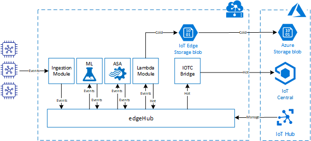
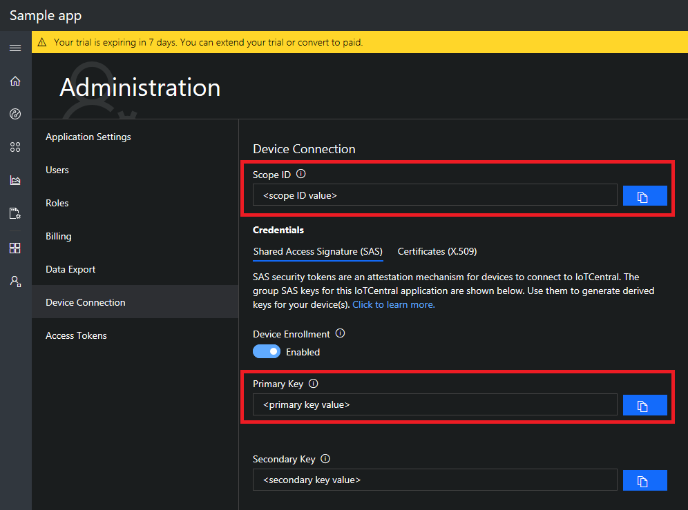
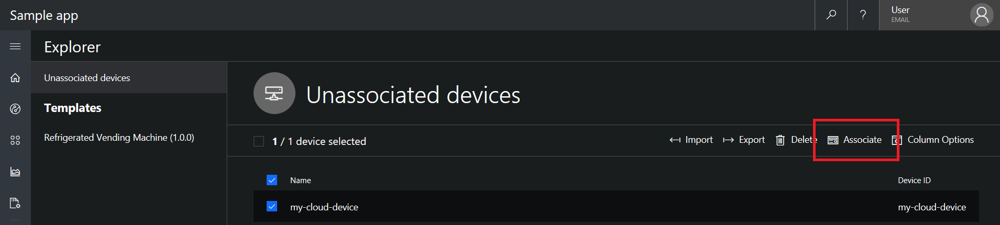

# Using Azure IoT Edge to preprocess Azure IoT Central device telemetry
[Azure IoT Central](https://docs.microsoft.com/nl-nl/azure/iot-central/overview-iot-central) is a powerfull IoT SaaS solution provided by Microsoft. Currently Azure IoT Central has some contraints on preprocessing telemetry and connecting legacy devices. To overcome these constraints you can use Azure IoT Edge as the preprocessing engine. Azure IoT Edge comes with a number features that allows you to extend your use of Azure IoT Central as your core IoT platform.
This github repository contains an example on how to reuse the [Azure IoT Central Device Bridge](https://github.com/Azure/iotc-device-bridge) code to create a IoT Central Bridge module.

# Implementing the Lamba architecure on Azure IoT Edge
[Azure IoT Edge](https://docs.microsoft.com/en-us/azure/iot-edge/) is an Internet of Things (IoT) service that builds on top of IoT Hub. This service is meant for customers who want to analyze data on devices, a.k.a. "at the edge", instead of in the cloud. This service can be combined with Azure IoT Central to a powerfull platform that enables telemetry preprocessing as well as connectivity of legacy devices to Azure IoT Central. Next to this Azure IoT Edge also enables the use of standard and custom modules to extend the preprocessing power.

## IoT Edge modules
IoT Edge modules are units of execution, implemented as Docker compatible containers, that run your business logic at the edge. Multiple modules can be configured to communicate with each other, creating a pipeline of data processing. You can develop custom modules or package certain Azure services into modules that provide insights offline and at the edge.

## Lambda architecure
Lambda architecture is a data-processing architecture designed to handle massive quantities of data by taking advantage of both batch and stream-processing methods. This approach to architecture attempts to balance latency, throughput, and fault-tolerance by using batch processing to provide comprehensive and accurate views of batch data, while simultaneously using real-time stream processing to provide views of online data. Lambda architecture describes a system consisting of three layers: batch processing, speed (or real-time) processing, and a serving layer for responding to queries. 
The combination of Azure IoT Edge and Azure IoT Central can be used to implement this approach. Where Azure IoT Edge will be used to be the dispatcher for hot and cold data and Azure IoT Central can be used as the serving layer for the hot data.
The picture below depicts an approach for using Azure packaged servcies as modules to enable the Lambda architecture on the Iot Edge and add intelligence as preprocessor to Azure IoT Central.



## Using packaged Azure Services
There are a number of Azure Services that can be used as modules on the IoT Edge. These services can enrich the Azure IoT Central experience by creating and preprocessing data as well as overcome Azure IoT Central constraints.

### Azure Stream Analytics module
IoT solutions use analytics services to gain insight about data as it arrives in the cloud from the IoT devices. With Azure IoT Edge, you can take Azure Stream Analytics ([tutorial](https://docs.microsoft.com/en-us/azure/iot-edge/tutorial-deploy-stream-analytics)) logic and move it onto the device itself. By processing telemetry streams at the edge, you can reduce the amount of uploaded data to Azure IoT Central and reduce the time it takes to react to actionable insights.

### Azure Functions module
You can use Azure Functions ([tutorial](https://docs.microsoft.com/en-us/azure/iot-edge/tutorial-deploy-function)) to deploy code that implements your business logic directly to your Azure IoT Edge devices. By processing telemetry streams at the edge, you can transform the data and reduce the amount of uploaded data to Azure IoT Central.

### Azure Machine Learning module
You can use Azure Machine Learning modules ([tutorial](https://docs.microsoft.com/en-us/azure/iot-edge/tutorial-deploy-machine-learning)) to deploy code that implements your business logic directly to your IoT Edge devices. By enriching telemetry streams at the edge, you can create states and events that can be send to Azure IoT Central.

### Azure Blob Storage module
Azure Blob Storage on IoT Edge ([tutorial](https://docs.microsoft.com/en-us/azure/iot-edge/how-to-store-data-blob)) provides a block blob storage solution at the edge. A blob storage module on your IoT Edge device behaves like an Azure block blob service, but the block blobs are stored locally on your IoT Edge device. It can be used to store cold data as well as automaticcaly sychronize the data with blob storage in the cloud.

## Azure IoT Hub
Azure IoT Hub is a managed service, hosted in the cloud, that acts as a central message hub for bi-directional communication between your IoT application and the devices it manages. In this example Azure IoT Hub is used to manage the Azure IoT Edge devices and modules. 

# Example: Azure IoT Central Bridge Module
This repository contains a Viual Studio Code example of an Azure IoT Edge module (Node.js) that can be used to send telemetry to Azure IoT Central. This example is based on the [Azure IoT Central Device Bridge](https://github.com/Azure/iotc-device-bridge). Almost all code is the same except for the index.js file, which is replaced by an app.js file acting as a Azure IoT Edge module. This example consists of 2 Azure IoT Edge modules. The IOTCBridgeModule that ensures device register to and messages are send to Azure IoT Central, and a transformation module (IOTCSimulatorModule) that transforms the data coming from the [Simulated Temperature Sensor](https://azuremarketplace.microsoft.com/en/marketplace/apps/microsoft.edge-simulated-temperature-sensor-ga?tab=Overview) module.

## Converting the Azure IoT Central Device Bridge into a module
The IOTCBridgeModule uses the code from [Azure IoT Central Device Bridge](https://github.com/Azure/iotc-device-bridge) to create a IoT Central device telemetry bridge module. How is this done?
Steps to take to create and run the module:
1. Create a Node.js IoT Edge Module in Visual Studio Code using the first part of [this](https://docs.microsoft.com/en-us/azure/iot-edge/tutorial-node-module) tutorial.
2. Copy the [Azure IoT Central Device Bridge](https://github.com/Azure/iotc-device-bridge) code from github.
3. Copy the following files into the Edge Module project:
```
- /lib/engine.js
- error.js
```
4. Change the code in the app.js to
```
'use strict';

var Transport = require('azure-iot-device-mqtt').Mqtt;
var Client = require('azure-iot-device').ModuleClient;
// Message handler IOTC Bridge
const handleMessage = require('./lib/engine');

// Constants to access IoT Central
const parameters = {
  idScope: process.env.ID_SCOPE,
  primaryKeyUrl: process.env.IOTC_KEY
};

// Create a context object that is normally present in an Azure function
// log is used with the iotc bridge
let context = {
  log(args) {
    console.log(args);
  }
}

// Get the module client
Client.fromEnvironment(Transport, function (err, client) {
  if (err) {
    throw err;
  } else {
    client.on('error', function (err) {
      throw err;
    });

    // connect to the Edge instance
    client.open(function (err) {
      if (err) {
        throw err;
      } else {
        console.log('[INFO] IoT Hub module client initialized');

        // Act on input messages to the module.
        client.on('inputMessage', function (inputName, msg) {
          pipeMessage(client, inputName, msg);
        });
      }
    });
  }
});

// This function just pipes the messages to the iotc bridge without any change.
async function pipeMessage(client, inputName, msg) {
  client.complete(msg, console.log('[INFO] Receiving message'));

  // Check if the message is sent to the iotc input, if not ignore
  if (inputName === 'iotc') {
    if (msg) {
      // Create the message as the iotc bridge expects it to be [req]
      var req = JSON.parse(msg.getBytes().toString('utf8'));
      // Pass the context and req object parts to the iotc bridge
      try {
        await handleMessage({ ...parameters, log: context.log, getSecret: getPrimaryKey }, req.device, req.measurements, req.timestamp);
      } catch (e) {
          context.log('[ERROR] ' + e.message);
      }
    }
  }
}

/**
 * Returns the primary key for IoT Central from the environment variables
 * Simplyfied because we don't use key vault on the edge
 */
async function getPrimaryKey(context, secretUrl) {
  context.log('[INFO] Returning IoT Central primary key: ' + secretUrl);
  return secretUrl;
}
```
5. Create an .env file to hold the IoT Central Scope ID and Primary or Secondary key
```
ID_SCOPE=<Your IoT Central Scope ID>
IOTC_KEY=<Your Iot Central Primary or Secondary key>
```
6. Go to your IoT Central application, and navigate to the `Administration > Device Connection` area.
  - Copy the `Scope ID` and paste it into the `ID_SCOPE` enviroment variable. 
  - Copy one of the SAS keys, so either the `Primary Key` or the `Secondary Key`, and paste it into the `IOTC_KEY` environment variable.

  

    These environment variables should be used in the deployment template in your solution as part of the IOTCBridgeModule deployment (see my example deployment template i this solution).

7. Build and deploy the IoT Edge module.

NB: Messages sent to the device bridge module input must have the following example format in the body:
```json
{
    "device": {
        "deviceId": "my-cloud-device"
    },
    "measurements": {
        "temp": 20.31,
        "pressure": 50,
        "humidity": 8.5,
        "ledColor": "blue"
    }
}
```
An optional timestamp field can be included in the body, to specify the UTC date and time of the message. This field must be in ISO format (e.g., YYYY-MM-DDTHH:mm:ss.sssZ). If timestamp is not provided, the current date and time will be used.

NOTE: deviceId must be alphanumeric, lowercase, and may contain hyphens. The values of the fields in measurements must be numbers or strings.

8. Create a device template in IoT Central that reflect the information send by the IOTCBridgeModule.

9. When a message with a new deviceId is sent to IoT Central by the device bridge, a device will be created as an Unassociated device. Unassociated devices appear in your IoT Central application in Device Explorer > Unassociated devices. Click Associate and choose a device template to start receiving incoming measurements from that device in IoT Central.

NOTE: Until the device is associated to a template, HTTP calls to the function will return a 403 error status.


## Modules and routing
The example contains an example module that transforms the telemetry coming out of the Simulated Temperature Sensor module. The only thing this module does is to take the simulated telemetry as input and then transforms it into the telemetry as expected by the IOTCBridgeModule. The IOTCBridgeModule listens to 'iotc' as input and if a message arrives it connects as a device to IoT Central and send the message.

NB: Example route
```json
"routes": {
    "IOTCSimulatorModuleToIoTHub": "FROM /messages/modules/IOTCSimulatorModule/outputs/* INTO BrokeredEndpoint(\"/modules/IOTCBridgeModule/inputs/iotc\")",
    "SimulatedTemperatureSensorToIOTCSimulatorModule": "FROM /messages/modules/SimulatedTemperatureSensor/outputs/* INTO BrokeredEndpoint(\"/modules/IOTCSimulatorModule/inputs/device1\")",
    "upstream": "FROM /messages/modules/SimulatedTemperatureSensor/outputs/* INTO $upstream"
}
```

## Limitations
This device bridge module only forwards messages to IoT Central, and does not send messages back to devices. Due to the unidirectional nature of this solution, `settings` and `commands` will **not** work for devices that connect to IoT Central through this device bridge. Because device twin operations are also not supported, it's **not** possible to update `device properties` through this setup. To use these features, a device must be connected directly to IoT Central using one of the [Azure IoT device SDKs](https://docs.microsoft.com/en-us/azure/iot-hub/iot-hub-devguide-sdks).

# Contributing
This project welcomes contributions and suggestions.

This project has adopted the [Microsoft Open Source Code of Conduct](https://opensource.microsoft.com/codeofconduct/).
For more information see the [Code of Conduct FAQ](https://opensource.microsoft.com/codeofconduct/faq/) or
contact [opencode@microsoft.com](mailto:opencode@microsoft.com) with any additional questions or comments.